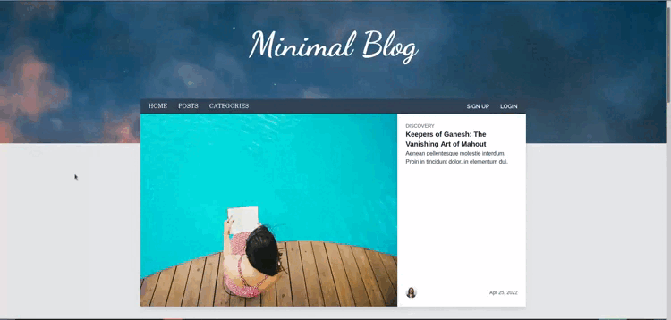
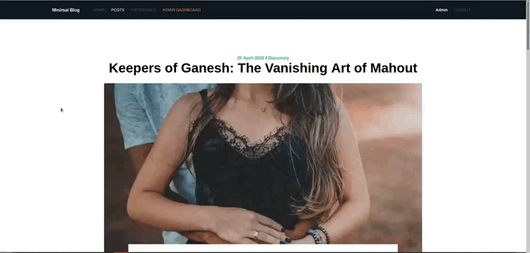

# Minimal Blog

Minimal Blog is a simple blog designed with a minimalist interface. 
A user can move into categories, read articles and interact with the author through comment section.
The author of the blog has complete control on every content via a secure admin dashboard. 

---

 This project was created in order to show some of my skills like  :
* Basic integration with TailwindCSS elements
* CRUD on categories, posts, comments, newsletters
* Security (authentification, authorization, voters)
* Customs elements (slugifier service, twig extension for dates, validator, querybuilders...)
* Doctrine paginators
* Async messages (newsletter emails) with Messenger and RabbitMQ via Docker
* Test covering (unit and functionnal tests) with PHPUnit

## Get Started 

### Prerequisites

*  PHP 8.1 or higher (Symfony 6.1)
* Composer
* Yarn / NodeJS
* Docker

### Install

1. Clone this project
2. Install dependencies with `composer install` and `yarn install`
3. Create your `.env.local` and add your own database DSN
4. Create database, apply migrations, and fill it with fixtures : 
`bin/console doctrine:database:create`
`bin/console doctrine:migrations:migrate`
`bin/console doctrine:fixtures:load`

### Working

1. Run `docker-compose up` to start Docker images (mailcatcher and RabbitMQ server)
2. Edit your `.env.local` by updating `RABBITMQ_DSN` and `MAILER_DSN`, you can find them by running :
`symfony var:export --multiline | grep 'MAILER_DSN\|RABBITMQ_DSN'`
3. Run `yarn run dev --watch` to launch your local server for assets
4. Run `symfony serve` to launch your local php web server
5. **Done ! Check your localhost server :** `http://127.0.0.1:8000/`

### Consume asynchronous messages

1. Run `symfony open:local:rabbitmq` and `symfony open:local:webmail` to start RabbitMQ server and the web mailcatcher
2. Login to RabbitMQ with credentials : `guest:guest`
3. To send messages to RabbitMQ, log in as admin (`admin@minimal.com:admin`) then go in the Admin Dashboard and click on "Newsletter", you'll see a "Send" button, it will send 1 message per subscriber to the newsletter (default 50).
4. Run `bin/console messenger:consume -vv async` to consume messages in RabbitMQ, they will progressively being sent and displayed in the mailcatcher.

### Testing

By default, all tests work with fixtures, so don't forget to load them !
1. Update your `.env.test` and add your test database DSN
2. Create database, apply migrations, and fill it with fixtures : 
`bin/console doctrine:database:create --env=test`
`bin/console doctrine:migrations:migrate --env=test`
`bin/console doctrine:fixtures:load --env=test`
3. Run `bin/phpunit` to launch the battery of tests

## Built With

* Symfony 6.1
* MySQL
* TailwindCSS (Ghostwind theme)
* Docker
* RabbitMQ
* PHPUnit

